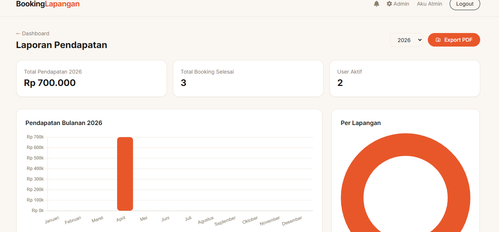

# BookingLapangan

Sistem booking lapangan olahraga berbasis web menggunakan PHP, MySQL, dan Tailwind CSS.




---

## Fitur

**User**

- Registrasi & login akun
- Kalender booking interaktif
- Pilih lapangan, tanggal, jam, dan durasi
- Deteksi konflik jadwal otomatis
- Kalkulasi total harga real-time
- Riwayat booking dengan status
- Notifikasi perubahan status booking

**Admin**

- Dashboard dengan statistik ringkas
- Kelola booking — konfirmasi, tolak, tandai selesai
- Kelola lapangan — tambah, edit, hapus
- Kalender jadwal per lapangan
- Laporan pendapatan dengan chart bulanan & per lapangan
- Export laporan ke PDF

---

## Teknologi

| Layer    | Stack                   |
| -------- | ----------------------- |
| Backend  | PHP 8+                  |
| Database | MySQL                   |
| Styling  | Tailwind CSS (CDN)      |
| Font     | Inter (Google Fonts)    |
| Chart    | Chart.js 4              |
| PDF      | jsPDF + jsPDF-AutoTable |

---

## Struktur Proyek

```
/
├── admin/
│   ├── index.php        # Dashboard admin
│   ├── bookings.php     # Kelola booking
│   ├── jadwal.php       # Kelola lapangan & kalender jadwal
│   └── laporan.php      # Chart pendapatan & export PDF
├── config/
│   └── db.php           # Koneksi database & session start
├── includes/
│   ├── auth.php         # Helper autentikasi & notifikasi
│   ├── header.php       # Navbar & head HTML
│   └── footer.php       # Footer HTML
├── screenshot/
├── index.php            # Beranda & kalender
├── booking.php          # Form booking
├── status.php           # Riwayat booking user
├── notifikasi.php       # Halaman notifikasi
├── login.php
├── register.php
├── logout.php
└── database.sql         # Skema & seed data
```

---

## Instalasi

### Prasyarat

- XAMPP / Laragon / WAMP (PHP 8+, MySQL)
- Browser modern

### Langkah

**1. Clone atau copy folder proyek**

Taruh folder proyek di dalam direktori web server:

- XAMPP: `C:/xampp/htdocs/booking-lapangan/`
- Laragon: `C:/laragon/www/booking-lapangan/`

**2. Import database**

Buka phpMyAdmin lalu import file `database.sql`, atau jalankan via terminal:

```bash
mysql -u root -p < database.sql
```

**3. Sesuaikan konfigurasi database**

Edit file `config/db.php`:

```php
define('DB_HOST', 'localhost');
define('DB_USER', 'root');   // sesuaikan
define('DB_PASS', '');       // sesuaikan
define('DB_NAME', 'booking_lapangan');
```

**4. Akses di browser**

```
http://localhost/booking-lapangan/
```

---

## Akun Default

| Role  | Email             | Password |
| ----- | ----------------- | -------- |
| Admin | admin@booking.com | password |

---

## Penggunaan

### Sebagai User

1. Daftar akun baru atau login
2. Klik tanggal di kalender atau tombol "Pesan Sekarang" pada lapangan
3. Pilih lapangan, jam mulai, dan durasi
4. Submit — booking masuk status **Menunggu**
5. Pantau status di menu **Riwayat Booking**
6. Notifikasi otomatis masuk saat admin mengkonfirmasi atau menolak

### Sebagai Admin

1. Login dengan akun admin
2. Masuk ke **Dashboard Admin** via menu navbar
3. Kelola booking di menu **Kelola Booking** — konfirmasi atau tolak
4. Tambah/edit lapangan di menu **Kelola Lapangan**
5. Lihat laporan pendapatan & export PDF di menu **Laporan**

---

## Status Booking

| Status       | Keterangan                         |
| ------------ | ---------------------------------- |
| Menunggu     | Booking baru, belum diproses admin |
| Dikonfirmasi | Admin telah menyetujui booking     |
| Ditolak      | Admin menolak booking              |
| Selesai      | Booking telah selesai digunakan    |

---

## Screenshot


